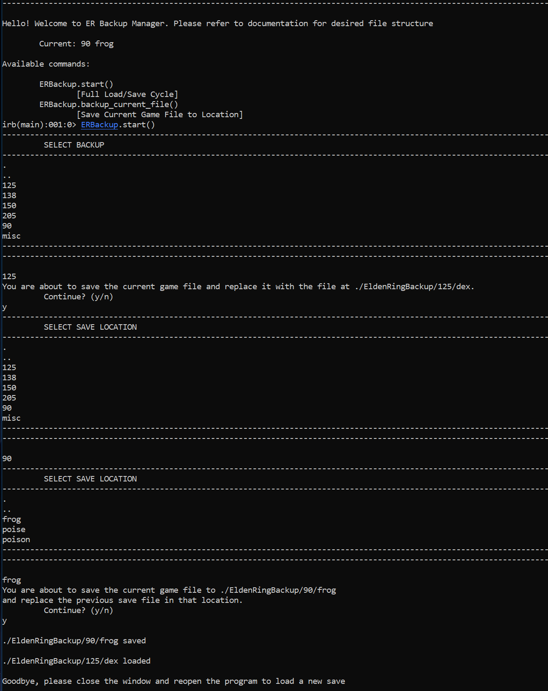

I was tired of opening my file sytem everytime I wanted to load a new ER save file for PvP,
this code does it for me.

### File Structure:
  - Inside `C:\Users\User\AppData\Roaming\EldenRing` create a folder called `EldenRingBackup`.
  - Inside of that new folder, create a folder called `misc`
  - & inside of that a folder called `HOLD`
  - & inside of that a folder called `0`.

  - For each save file, create a folder with your level and COPY/PASTE `ER0000.sl2` from `C:\Users\User\AppData\Roaming\EldenRing\{LONG_STRING_OF_NUMBERS}` inside of it.


Example File Structure:
```
|- C:\Users\User\AppData\Roaming\EldenRing
  |- {LONG_STRING_OF_NUMBERS} <!-- the folder the game loads from -->
  |- EldenRingBackup
    |- 90
      |- Arcane               
        |- ER0000.sl2         <!-- A level 90 Arcane build file -->
    |- 125
      |- Dex
        |- ER0000.sl2         <!-- A level 125 Dex build file -->
    |- misc
      |- HOLD
        |- 0
  |- GraphicsConfig.xml
```


## Installation

  Right-Click Dekstop > New Shortcut > Location: `"C:\Windows\System32\cmd.exe"` > Give Shortcut a name

  Open Properties of shortcut, replace target with below. Replace {} with path to repository.
    `C:\Windows\System32\cmd.exe /k cd {LOCATION_OF_REPO}/er-backup-manager & irb -r './index.rb'`


## Sample Execution:
