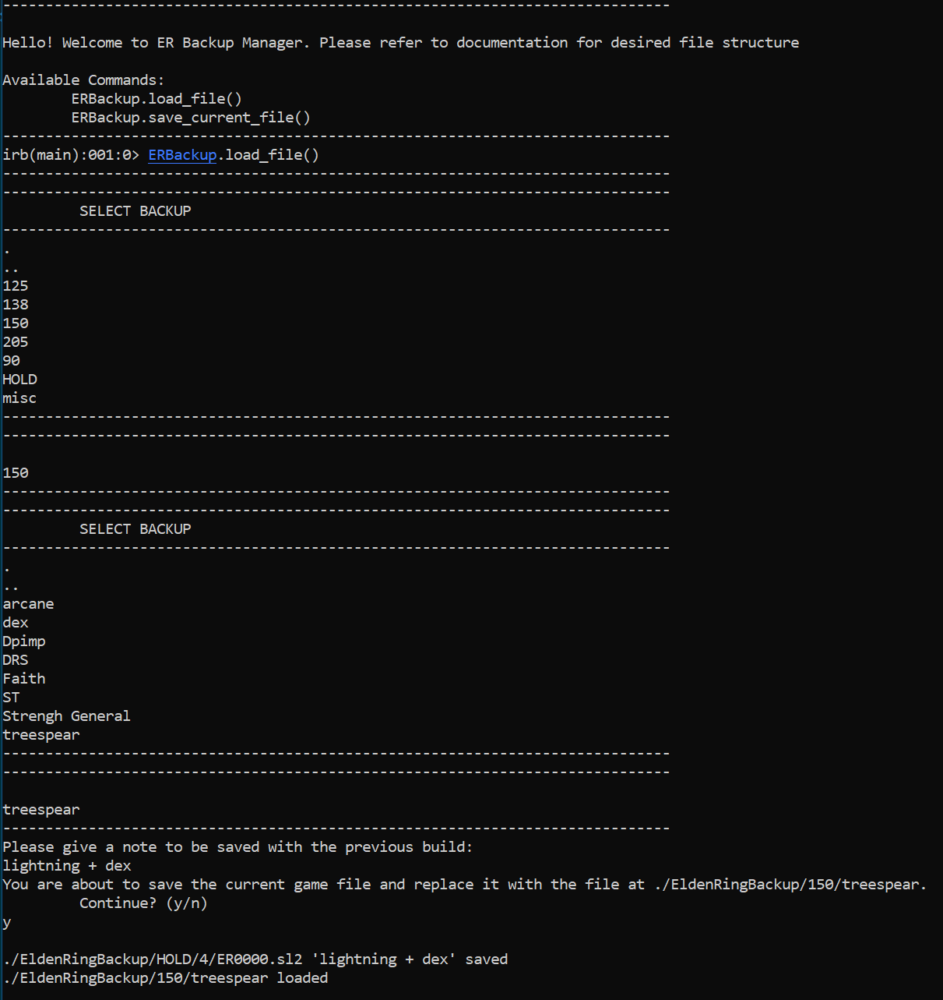

### File Structure:
  - Inside `C:\Users\User\AppData\Roaming\EldenRing` create a folder called `EldenRingBackup`.
  - Inside of that folder create a folder called `HOLD`.
  - Inside of that a folder called `0`.
  - For each save file, create a folder with your level name and the `ER0000.sl2` from `C:\Users\User\AppData\Roaming\EldenRing\{LONG_STRING_OF_NUMBERS}` inside of it.

Example:
```
|- C:\Users\User\AppData\Roaming\EldenRing
  <!-- the folder the game loads from -->
  |- {LONG_STRING_OF_NUMBERS} 
  |- EldenRingBackup
    |- 90
      |- Arcane
        <!-- A level 90 Arcane build file -->
        |- ER0000.sl2
    |- 125
      |- Dex
        <!-- A level 125 Dex build file -->
        |- ER0000.sl2
    |- HOLD
      |- 0
  |- GraphicsConfig.xml
```


Windows:

  New Shortcut > Location: `"C:\Windows\System32\cmd.exe"` > Give Shortcut a name

  Open Properties of shortcut, replace target with below. Replace {} with path to repository.
    `C:\Windows\System32\cmd.exe /k cd {LOCATION_OF_REPO}/er-backup-manager & irb -r './index.rb'`


Sample Execution:
